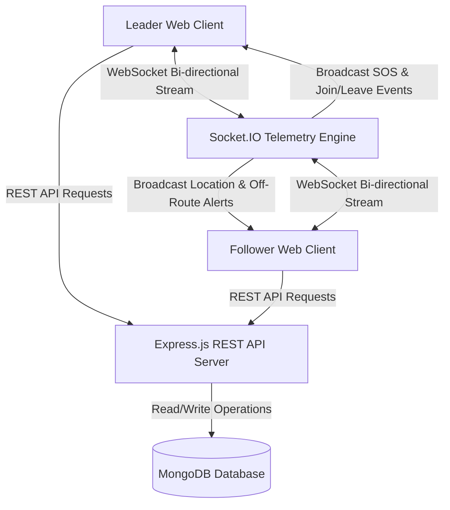
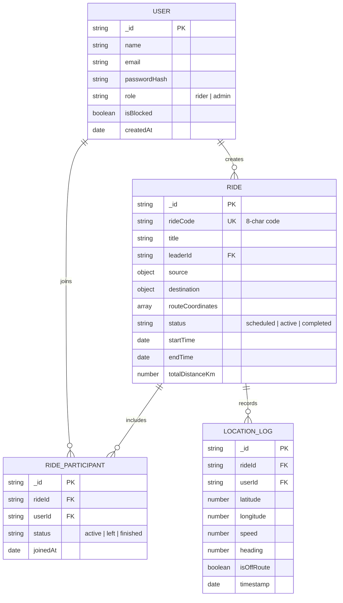
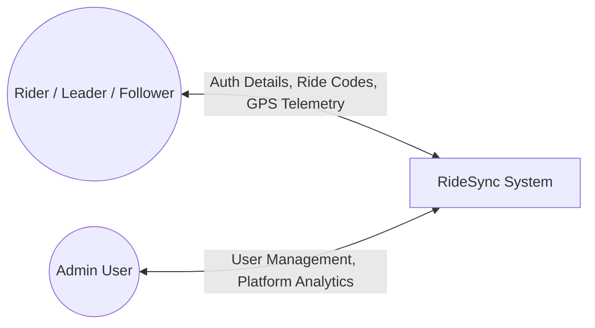
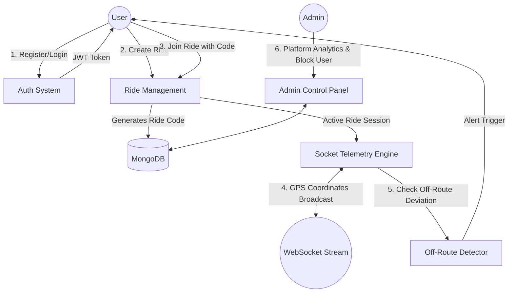
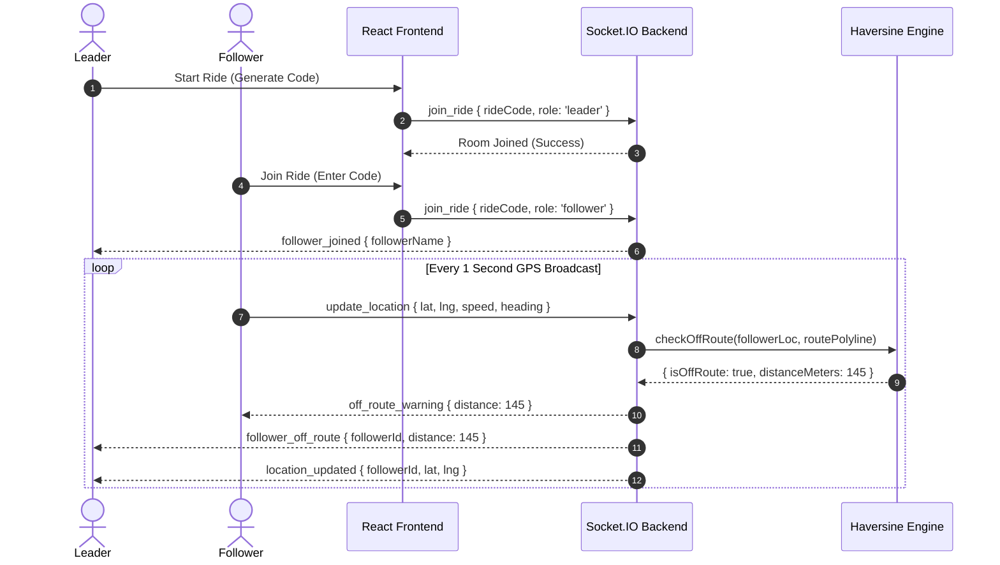
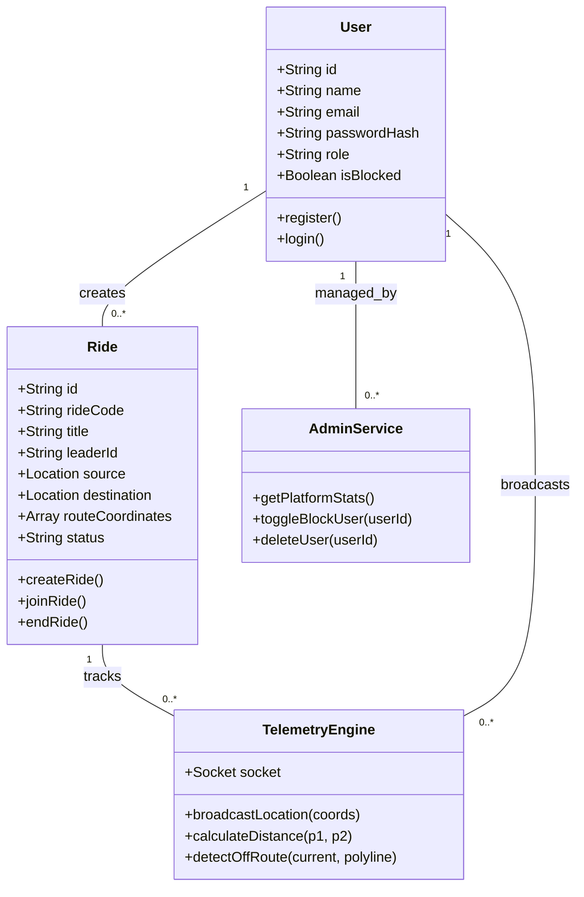

# 📚 RideSync - Academic Project Documentation (Blackbook)

**Project Title**: RideSync: Real-Time Biker Group Ride Tracking System  
**Author**: Harshal Sane  
**Institution**: Thakur College of Engineering & Technology (TCET), Mumbai  
**Department**: Information Technology (B.E. IT)  
**Technology Stack**: MERN Stack (MongoDB, Express.js, React.js, Node.js), Socket.IO, Leaflet JS, JWT  

---

## 1. System Architecture Overview

RideSync follows a micro-decoupled **Client-Server Architecture** featuring a single-page React frontend, a RESTful Node/Express backend, MongoDB persistence, and an event-driven Socket.IO real-time communication pipeline.



---

## 2. Entity-Relationship (ER) Diagram



---

## 3. Data Flow Diagrams (DFD)

### DFD Level 0 (Context Diagram)



### DFD Level 1



---

## 4. Use Case Diagram

```mermaid
graph LR
    subgraph RideSync Platform
        UC1[Register & Authenticate]
        UC2[Create Ride Session]
        UC3[Join Ride via 8-Char Code]
        UC4[Broadcast Live GPS Location]
        UC5[View Heads-Up Map Telemetry]
        UC6[Receive Off-Route Alerts]
        UC7[Broadcast Emergency SOS]
        UC8[View Completed Ride History]
        UC9[Manage Users & Platform Stats]
    end

    Rider Leader --> UC1
    Rider Leader --> UC2
    Rider Leader --> UC4
    Rider Leader --> UC5
    Rider Leader --> UC7
    Rider Leader --> UC8

    Follower Rider --> UC1
    Follower Rider --> UC3
    Follower Rider --> UC4
    Follower Rider --> UC5
    Follower Rider --> UC6
    Follower Rider --> UC7
    Follower Rider --> UC8

    Admin User --> UC1
    Admin User --> UC9
```

---

## 5. Sequence Diagram (Live Ride & Location Broadcast)



---

## 6. Class Diagram



---

## 7. Mathematical Model: Haversine & Off-Route Distance Formula

To determine real-time off-route deviation between follower GPS point $P(lat_p, lng_p)$ and route line segment $AB$ between waypoint vertices $A(lat_a, lng_a)$ and $B(lat_b, lng_b)$, the Haversine formula is used to derive surface distance $d$:

$$a = \sin^2\left(\frac{\Delta \phi}{2}\right) + \cos(\phi_1) \cdot \cos(\phi_2) \cdot \sin^2\left(\frac{\Delta \lambda}{2}\right)$$

$$c = 2 \cdot \operatorname{atan2}\left(\sqrt{a}, \sqrt{1-a}\right)$$

$$d = R \cdot c$$

where $R = 6371000\text{ meters}$ (Earth radius), $\phi$ is latitude in radians, and $\lambda$ is longitude in radians. If $d > 100\text{ meters}$, an off-route alert event is dispatched via Socket.IO.
